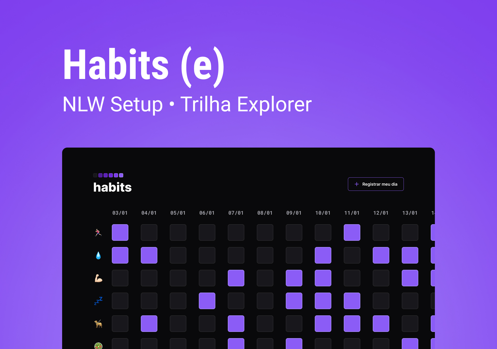

<h1 align="center"> Habits </h1>

NLW é um evento exclusivo e gratuito, promovido pela Rocketseat para ensino de tecnologias WEB. <br\>

    <a href="#tecnologias">Tecnologias</a>&nbsp;&nbsp;&nbsp;|&nbsp;&nbsp;&nbsp;
    <a href="#projeto">Projeto</a>&nbsp;&nbsp;&nbsp;|&nbsp;&nbsp;&nbsp;
    <a href="#layout">Layout</a>&nbsp;&nbsp;&nbsp;|&nbsp;&nbsp;&nbsp;
    <a href="#memo-licença">Licença</a>&nbsp;&nbsp;&nbsp;|&nbsp;&nbsp;&nbsp;

    

 

    

## Tecnologias

Esse projeto foi desenvolvido com as seguintes tecnologias:

- HTML e CSS
- JavaScript
- Git e Github
- Figma

## Projeto

O Habits é um app para ajudar a rastrear os hábitos.

- [Acesse o projeto finalizado, online](https://italol.github.io/NLWHabits/)

## Layout

Você pode visualizar o layout do projeto através [DESSE LINK](https://www.figma.com/file/8vofBVUbkg9InMBlXmONhE/Habits-(e)-(Community)?node-id=75%3A128&t=ScgtyFag09ClKpQ2-0). É necessário ter uma conta no [Figma](https://figma.com) para acessá-lo.

## :memo: Licença

Esse projeto está sob a licença MIT.

---

